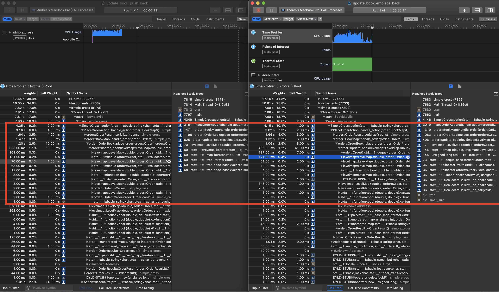

### Workload Assumptions, Operations, and Complexity
- There are "relatively few" ticker symbols with extremely high amounts of activity.
- Their OrderBooks have long FIFOs of orders.
- Realistically, I expect price levels accesses to be extremely tightly grouped around the best offers/asks.

When building data structures around price level accesses this would normally make me reach for an array or two (perhaps one for whole currency and then an array of fractions for each of those), but with the time I've had to think about the problem, my reaction is that it is simply too much memory:

An 8-byte pointer * 2400 symbols in the NYSE * 7 possible digits of whole currency (~192GB) is a lot to account for the possibility of the extremes, where each index in the array would hold a FIFO pointer. (Though one could take a bucketing approach and do short linear searches within each bucket. I chose not to add complexity in that direction, but I imagine someone somewhere has tried something like that with some success.)

With the above in mind, what I have is:

- SimpleCross Contains one `order::BookMap`.
- A `order::BookMap` contains 2 data structures:
  - `std::unordered_map<std::string, order::OrderBook>`.
  - `std::unordered_map<order::oid_t, order::Order>`. (where `oid_t` is a `uint32_t`)
- A `order::OrderBook` contains 2 of the following data structures:
  - `LevelMap<order::price_t, order::Order, std::deque, std::less>`
  - These are used to maintain outstanding orders at each price level.
  - LevelMap is backed by a `std::map<std::price_t, std::deque<order::Order>>`

#### Place Order
Where:
- n = # asks or offers
- m = # symbols
- k = # price levels per symbol
and assuming:
`n >>> m ==? k` (even though `k` could possibly span a 7 + 5 digit FP range....)
```
Worst:
O(n) OID dup-check +
O(m) symbol -> OrderBook +
O(log(k))^2 price level lookup and erase * O(n) order fill

==> O(n * log(k)^2)
```

I think the the typical complexity should be something like:
```
Typical:
O(1) OID dup-check/log +
O(1) symbol -> OrderBook +
O(log(k) price level lookup) * O(1) order fill/book

==> O(log(k))
```

#### Cancel Order
```
Worst:
O(n) OID log +
O(m) symbol -> OrderBook +
O(log(k))^2 price level lookup and erase +
O(1) Order lookup by idx (to set .qty = 0)

==> O(n)
# I think, because we assume fewer price levels than orders...
```

```
Typical:

==> O(log(k))

# Find the symbol, find the price level, and 0-out the order idx
```

#### Print Orders
```
==> O(m * k * n)

# Access all of the symbols then sorted price levels, then all of the orders.
```

Because of my choices, I expect:
1. More consistent performance of sorted book output. (instead of sort -> print)
2. *Hopefully* kinder access patterns for the memory subsystem when dealing with the most commonly accessed FIFOs.
3. Efficient cancels when only given an OID, avoiding a "who has?" style search through every book.

(`test_full_fills_asc_desc` appears to complete 32K order placements + 32K order fills in less about 0.5 seconds on my 2.3GHz i9. While I may not be even close to the ballpark of a real exchange filling 100,000s of orders/sec,
I hope I am playing the "same sport.")

### Pain Points

#### Additional Complexity required for cancellation...
If I knew anything else about the distribution of a typical workload and I could assert that cancels are rare/don't need to be optimized, I would lean away from my choice to implement the qty counters at each tier of the LevelMap.

That code is error prone and not fun to maintain. Further wrapping the counter/size-tracking operations (as one might notice I have tried) will unfortunately result in more log(k) lookups of the price levels, which I'd like to avoid in `update_book` since we've already found the level we need.

`update_book` is somewhat unwieldy because of the responsibility I've given it to pick up `kill_order`'s trash.

#### Space implications
With regard to data management and copying...

Because of my choices, to cancel using an OID without a search I basically need to store a whole `Order` object in the look-up table to have enough information to find the *real* `Order` object that I am after and finally 0-out its quantity. In effect, we should look at the Order struct's size and acknowledge it is really 2x. It should be noted that the Order copied into the lut does not contain a valid qty but can reasonably be expected to provide other valid information about the order.

Normally, this would call for storing a pointer; however, that is not safe in STL containers that dynamically reallocate to expand (`deque`). If I used very conservatively sized, statically-allocated containers maybe this would be back on the table.

**EDIT**: Upon further reading it appears that deque pointers are safe *as long as values are not erased from the middle*. I believe this means I could use pointers instead of having to store Order structs. It's also important to mention here that deques require two dereferences instead of the one required by vector to support this functionality.

### Current Bottlenecks

I wrote a script, `gen_actions.py` that streams order actions over stdin for a given number of symbols.

- buy/sell: `random.choice`
- quantity: `random.randint`
- price:    `np.random.normal`

where price is normally distributed about a randomly chosen mean price for each symbol.



My bottlenecks are in construction of Order/basic_string objects in the update_book routine to return result information.

Some next steps I would consider to resolve this:
- Use a symbol table and symbol ID instead of encoding a string, assuming no pathological case of exploding symbol count.
- Devise a better strategy of propagating out the result information without doing so much copying. Again, I could consider using pointers but that comes with much more careful consideration about the underlying containers in use for the FIFOs. With pointers I expect multithreaded/future-based implementations would have to go to non-trivial efforts in synchronization to make sure that the data returned back in the `results_t` is still valid.

### Future Work
On that note, think it'd be interesting to build queues of futures to handle this work, maybe something like:
```
[hash: AAPL, MSFT ...  ] --> FIFO [place_order, place_order, place_order]
[hash: BB, NOK, GME ...] --> FIFO [place_order, place_order, place_order]
```
since transactions across symbols should be parallelizable.

Also:
- More tests :)

I also want to buy a Linux machine so that I can actually use perf and other microarch tools to benchmark performance, though Apple's Instruments is pretty cool.
